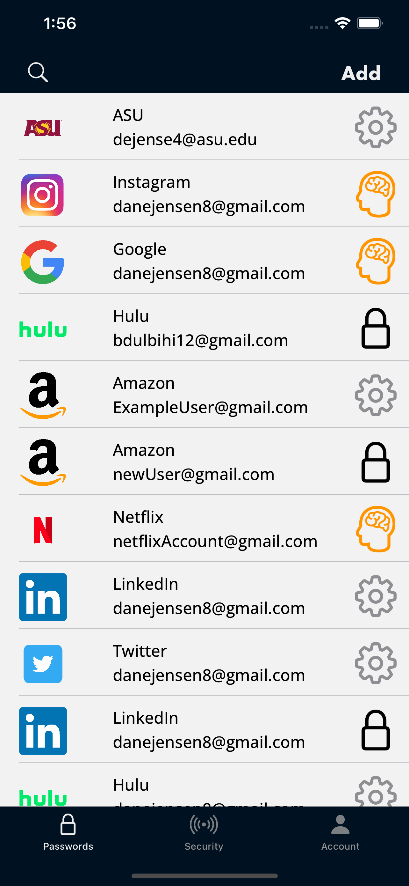
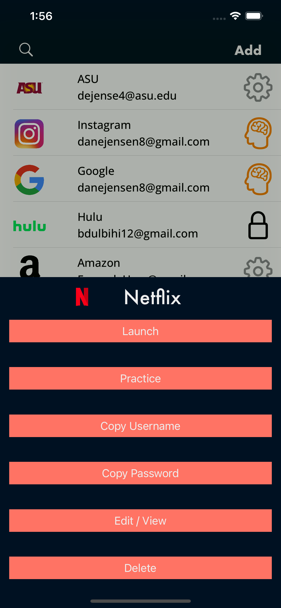
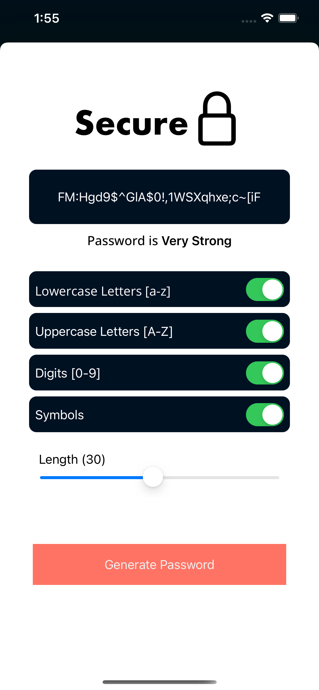
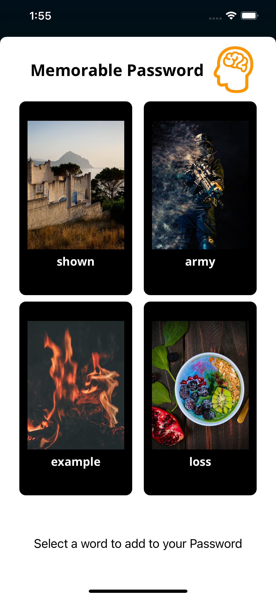
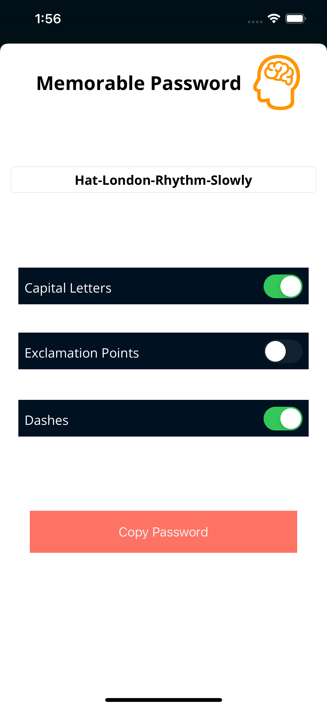
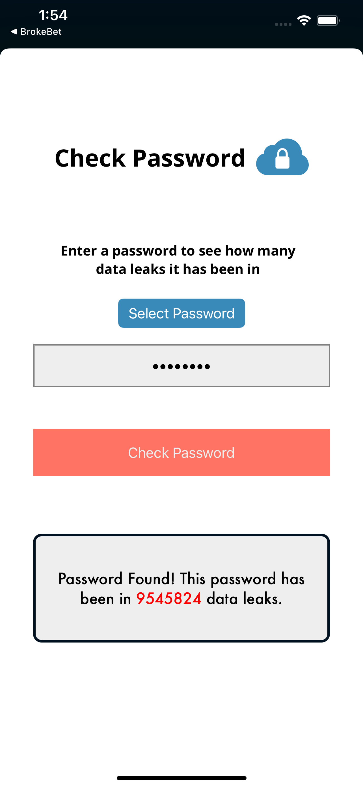
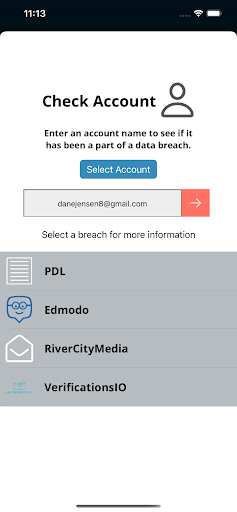

# Password Manager
## _FSE394 Class Project_

## App Description:

This app was created to give a free alternative to password storing apps such as LastPass. Our password manager allows for a custom memorable password generation as well as complex password generation built right into the app. The passwords are encrypted and stored on a server. You can check a password or an email account to see what security breaches they have been a part of. You can also launch the app and copy the password straight through the app.

